  

 

## 👋 About

I build **agentic AI systems** and the **cloud infrastructure** they run on — and I'm an optimist about where software is taking us.

- ⚡ Founder @ **RawrTech LLC** — AI agents & cloud engineering
- 🤝 Co-organizer of the **Copilot Collective** — an Irvine, CA community for Microsoft Copilot builders
- 🧠 Currently: multi-agent systems on the **Claude Agent SDK**, plus an **NVIDIA DGX Spark** homelab
- 🚀 A few ventures in stealth — launching soon

  

## 🛠️ Stack

**Languages**

  
  
  
  

**AI & agents**

  
  
  
  

**Cloud & infrastructure**

  
  
  
  
  
  
  
  

  

## 📊 Activity

  

 

  <picture>
    <source media="(prefers-color-scheme: dark)" srcset="https://raw.githubusercontent.com/mikedorado/mikedorado/output/serpent-dark.svg" />
    
  </picture>

  

## 🤝 Connect

  
  
  

  

<!--
  Hand-built, no third-party stats services:
  · hero/divider/footer are self-contained animated SVGs (CSS + SMIL, no JS, no external fonts)
  · palette: deep-sea blues (#02070F–#122A44), aqua glass (#7FD4CE), warm gold (#FFD98A/#E8B054)
  · scripts/telemetry.mjs renders in-house stats cards daily (via .github/workflows/snake.yml);
    not shown in the README yet — re-add the output-branch images once public activity grows
  · the contribution serpent regenerates daily from the same workflow
-->
